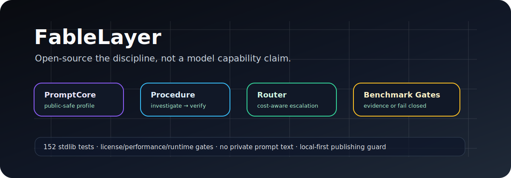

<p align="center">
  
</p>

# FableLayer

**FableLayer는 LLM 워크플로우를 위한 공개-safe 절차·검증·벤치마크 레이어입니다.**

모델의 기본 capability 자체를 옮긴다고 주장하지 않습니다. 대신 강한 에이전트 작업에서 반복 가능한 부분, 즉 근거 규율, 체계적 조사, fail-closed 게이트, 모델 라우팅, 정직한 benchmark 기록을 패키징합니다.

## 왜 필요한가

긴 프롬프트 복사나 근거 없는 품질 주장이 아니라, 다음 원칙을 코드와 게이트로 강제합니다.

- 비공개·독점 prompt text 미포함
- 미검증 성능 주장 금지
- 승인 없는 외부 publish 금지
- 근거 없는 “완료” 금지
- raw data와 한계 없는 benchmark 수치 금지

## 구성

| Layer | 역할 | 파일 |
|---|---|---|
| PromptCore | 결정론적 공개-safe operating profile | `fablelayer/promptcore.py`, `core/promptcore.md` |
| Evidence Gate | 근거 없는 완료 주장 차단 | `fablelayer/evidence_gate.py` |
| Router | 비용 인식 Sonnet/Opus/local 라우팅 | `fablelayer/router.py` |
| Adapters | Claude Code, Ollama, LM Studio, SillyTavern profile export | `fablelayer/adapters.py` |
| Benchmark | 결정론 fixture scoring과 raw JSON | `fablelayer/benchmark.py`, `bench/` |
| Gates | license, performance, runtime, render, publish, completeness 검증 | `gates/` |

## 빠른 시작

```bash
git clone https://github.com/VoidLight00/fablelayer.git
cd fablelayer

python3 tests/run_tests.py
bash gates/selftest.sh
bash gates/verify_fablelayer.sh . --mode new

./cli/fablelayer --help
./cli/fablelayer init --target ./_dist/demo --apply
```

자세한 설치는 [`docs/INSTALL.md`](./docs/INSTALL.md)를 보시면 됩니다.

## 검증

```bash
python3 tests/run_tests.py
bash gates/selftest.sh
bash gates/verify_fablelayer.sh . --mode new
```

현재 로컬 실측 기준:

- stdlib 테스트 152개 통과
- `LICENSE/PERF/BENCH/COMPLETE/RENDER/RUNTIME` 게이트 통과
- 승인 없는 publish는 의도적으로 비정상 종료

## 공개-safe 소스 정책

FableLayer는 독자 구현입니다. [`ATTRIBUTION.md`](./ATTRIBUTION.md)에 공개 방법론 참조를 기록하지만, 비공개·독점·비공개 prompt text를 복사하지 않습니다. 고위험 소스 클래스는 blocked/reference-only로 취급하며 프로젝트 사용에 필요하지 않습니다.

## 문서

- [`docs/INSTALL.md`](./docs/INSTALL.md)
- [`docs/DPTD.md`](./docs/DPTD.md) — 전문 기술 개요
- [`docs/DPTD-ADHD.md`](./docs/DPTD-ADHD.md) — ADHD 친화 빠른 가이드
- [`docs/DEVELOPMENT.md`](./docs/DEVELOPMENT.md)
- [`CONTRIBUTING.md`](./CONTRIBUTING.md)
- [`SECURITY.md`](./SECURITY.md)
- [`ROADMAP.md`](./ROADMAP.md)
- [`ATTRIBUTION.md`](./ATTRIBUTION.md)
- [`README.md`](./README.md)

## 라이선스

AGPL-3.0. [`LICENSE`](./LICENSE), [`NOTICE`](./NOTICE)를 참고해 주세요.
